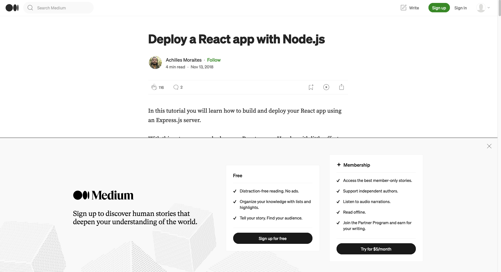
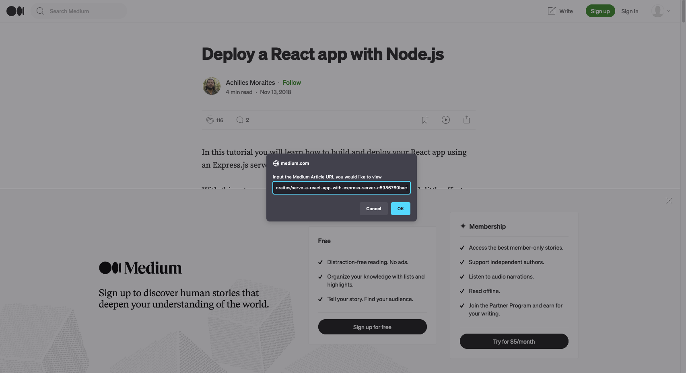
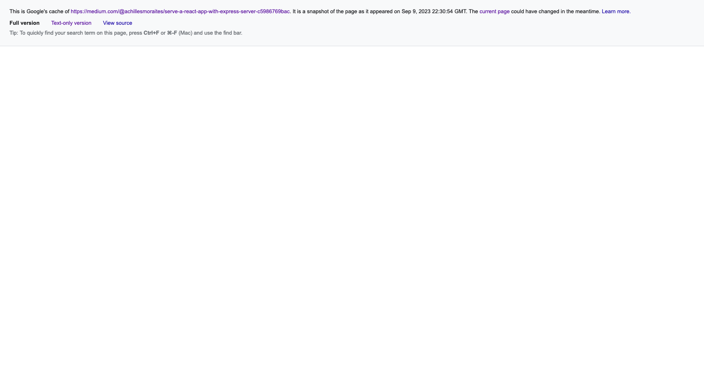
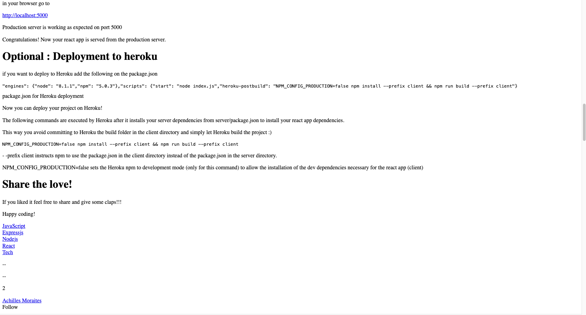

# Free Medium
Simple JS program that will prompt you for the URL of a Medium (or any other paywalled) article you would like to read, which will then direct you to a page where you can view the
contents of the article for free.

## Steps to create the Bookmarklet
1. Copy the contents of `dist/index.js`
2. In a Browser, create a new Bookmark
3. In the Bookmark form, first enter:
```js
javascript: (() => {})();
```
4. In the function block (`{}`), paste in the code you copied from `dist/index.js`
- Note: Do not add any newlines, this program must fit onto one line to be valid
```js
javascript: (() => {const medUrl=prompt("Input the Medium Article URL you would like to view");const googCacheUrl="https://webcache.googleusercontent.com/search?q=cache:";let fullUrl="";if(medUrl){fullUrl=googCacheUrl+medUrl;location.assign(fullUrl)})();
```
5. Save the bookmark

## Steps to run the Bookmarklet
1. Click on your Bookmarklet
2. When prompted, enter the URL of the Medium article you want to view (Ex., https://medium.com/@achillesmoraites/serve-a-react-app-with-express-server-c5986769bac)





3. See that you get redirected to a page that looks like this:



4. Click "Text-only version"

5. See the full article is displayed (without pictures)



## Extras
- You can create a URL searchbar shortcut like "fm" that will activate this shortcut when typed.
